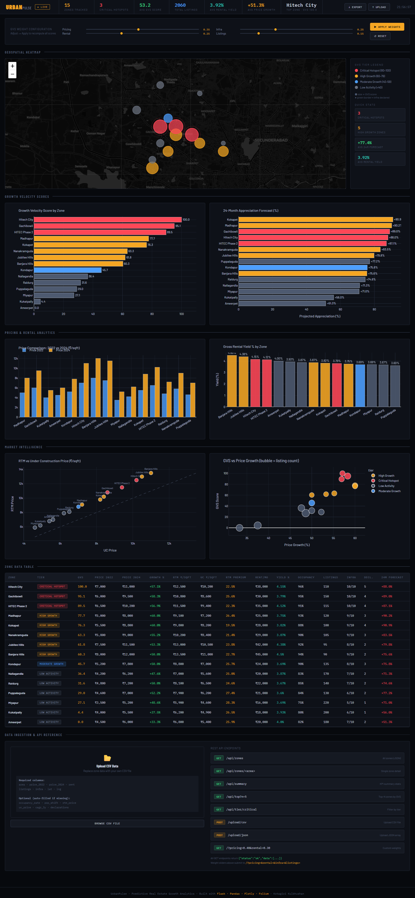

# UrbanPulse — Predictive Urban Growth Analytics Engine
### CyberJoar AI Assignment · Problem Statement 3
**Stack:** Python · Flask · Pandas · Plotly · Folium  
**Author:** Kotagiri Kulbhushan | kulbhushankotagiri@gmail.com

---

## Quick Start

```bash
# 1. Extract the project folder
cd urbanpulse

# 2. Install dependencies
pip install -r requirements.txt

# 3. Run the Flask server
python app.py

# 4. Open in browser
http://localhost:5000
```

---

## Project Structure

```
urbanpulse/
├── app.py                   ← Entry point — blueprint registration
├── requirements.txt
├── README.md
│
├── routes/
│   ├── dashboard.py         ← GET /        — full dashboard page
│   ├── api.py               ← GET /api/*   — JSON REST endpoints
│   └── upload.py            ← POST /upload — CSV/JSON ingestion
│
├── utils/
│   ├── data_engine.py       ← GVS engine (4 data streams, normalisation)
│   ├── charts.py            ← 6 Plotly chart builders
│   └── map_builder.py       ← Folium dark-map with styled popups
│
├── templates/
│   └── index.html           ← Jinja2 dashboard template
│
└── data/
    └── data.csv             ← 15-zone Hyderabad dataset
```

---

## GVS Formula

```
GVS = (Pricing × 0.35) + (Rental × 0.25) + (Infra × 0.25) + (Listings × 0.15)

Each sub-score normalised 0→1 before weighting.
Final GVS scaled to 0→100.
Weights adjustable via UI sliders or query params.
```

---

## API Reference

| Method | Endpoint | Description |
|---|---|---|
| GET | `/api/zones` | All zones with computed metrics |
| GET | `/api/zones/<area>` | Single zone by name |
| GET | `/api/summary` | KPI summary stats |
| GET | `/api/top?n=5` | Top-N zones by GVS |
| GET | `/api/tier/critical` | Filter zones by tier name |
| POST | `/upload/csv` | Upload a CSV file |
| POST | `/upload/json` | Upload JSON array |
| GET | `/?pricing=0.4&rental=0.3&infra=0.2&listings=0.1` | Custom weights |

---

## CSV Upload — Required Columns

```
area, price_2022, price_2024, rent, listings, infra, lat, lng
```

Optional (auto-filled): `occupancy_rate, pop_shift, rtm_price, uc_price, declarations`

---

## Design Approach

During development, the main challenge was handling fragmented data sources.

To address this:

Infrastructure data is treated as a leading indicator
Pricing & rental trends validate market demand
Listing density reflects competition & saturation

This combination helps simulate real-world investment decision logic.

---

## Output

The system provides:

Growth hotspots (high GVS zones)
Market trend insights
Future growth indicators
Zone-wise analytics dashboard

---

## Dashboard Preview
<p align="center">  </p>

